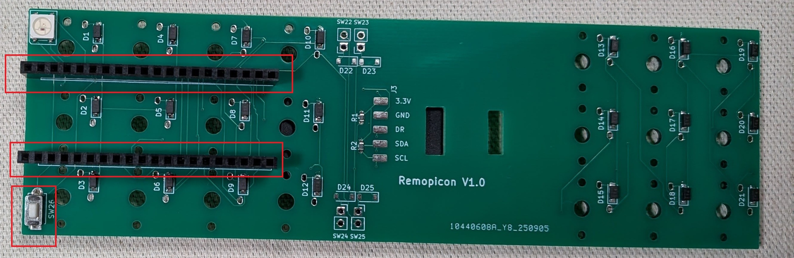
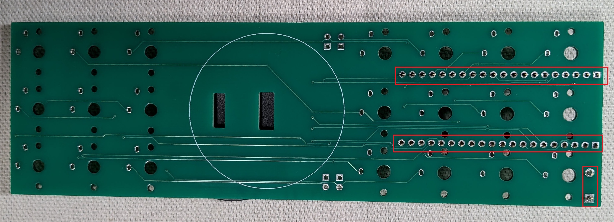
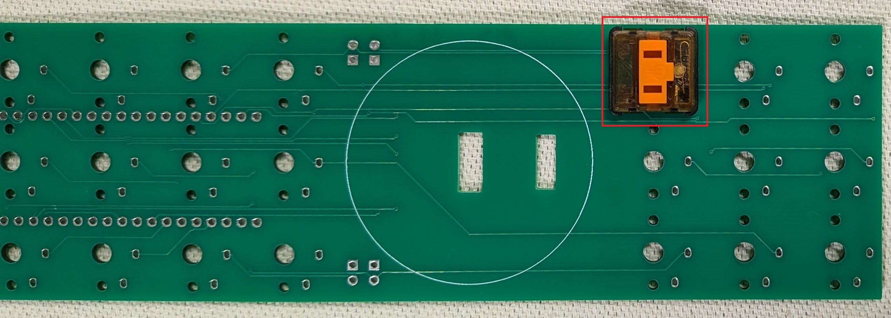
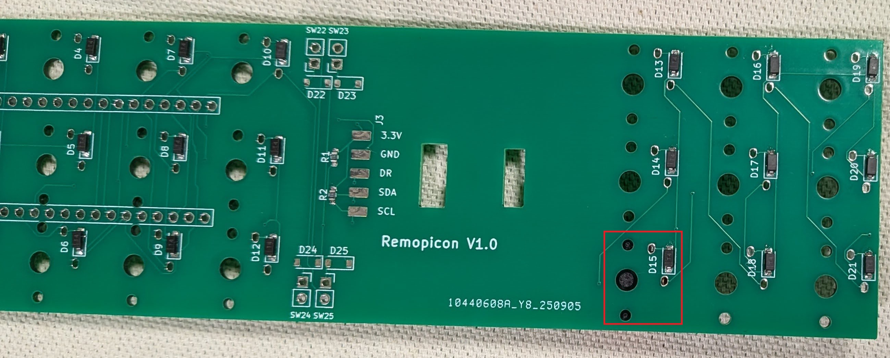
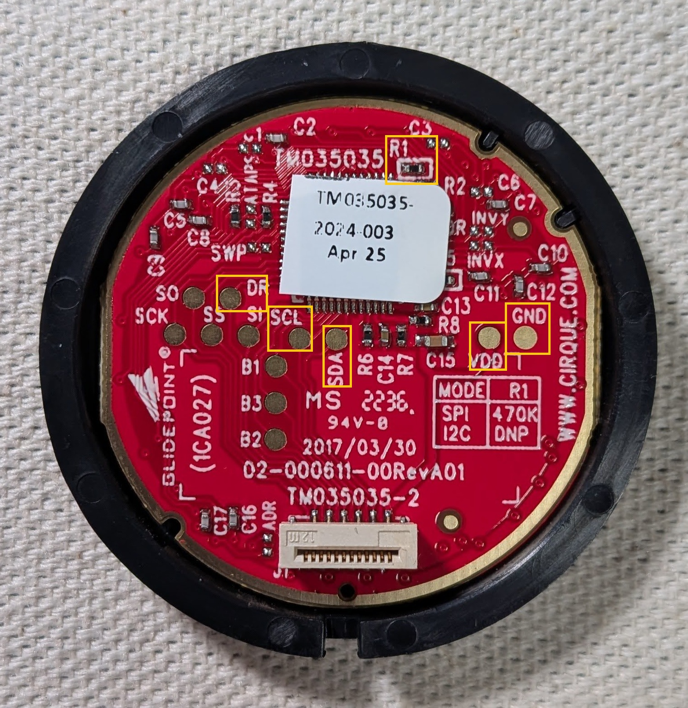
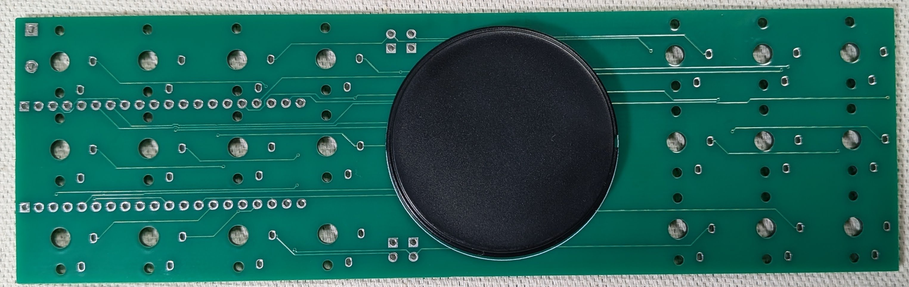
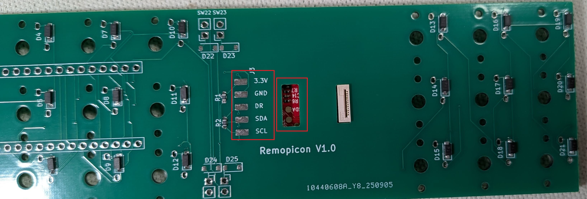
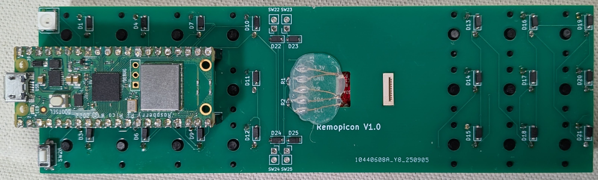
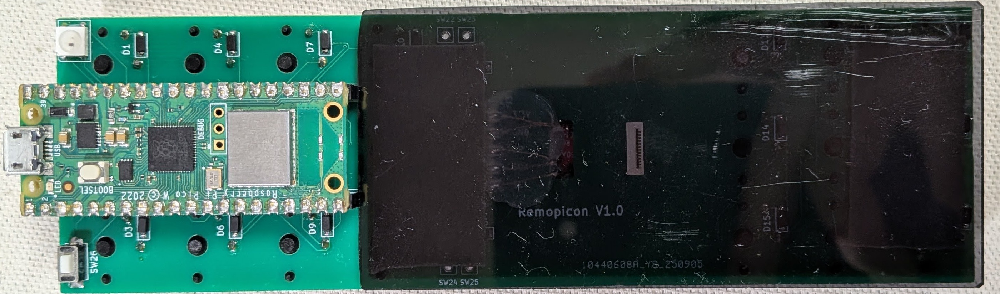

# Remopicon ビルドガイド (キーケット2026年版)

このビルドガイドは、キーケット2026年で頒布されたRemopiconキットのビルド手順を説明しています。

## 部品リスト

## キットに含まれる部品

- PCB (1個)
- ピンソケット (1x20ピン ×2個)
- タクトスイッチ (1個)

## キットに含まれない部品

- Raspberry Pi Pico W (1個)
- Choc V1 スイッチ（21個）
- [Cirque Pinnacle TM035035](https://mou.sr/4185zSP) トラックパッド (1個)

## オプション

- キーキャップ (キーピッチの都合上、つけない方が操作しやすい可能性があります。)

## ビルド手順

### 1. ピンソケットとタクトスイッチの取り付け

ピンソケットとタクトスイッチをはんだ付けします。

このとき、ハンダ面のピンの足をニッパーなどで切り落として、可能な限りフラットにしておく必要があります。
フラットにしないと、スイッチを取り付ける際に干渉してしまいます。

### 2. キースイッチの取り付け

キースイッチをはんだ付けします。

計21個のスイッチをはんだ付けします。

### 3. トラックパッドの準備

トラックパッドの取り付け準備をします。

画像上部の黄枠のR1を取り外します。これによりI2C通信モードになります。

また、画像下部の黄枠の5つのパッドにジャンパー線をはんだ付けします。

部品のリビジョンによってはパッドの位置が異なる可能性があるので、以下のシルクのパッドであることを確認して、はんだ付けしてください。

- VDD(3.3V)
- GND
- SDA
- SCL
- DR

### 4. トラックパッドの取り付け

トラックパッドを取り付けます。

両面テープまたはホットボンドなどで固定してください。

画像右の赤枠の部分からジャンパー線を通して、画像左の赤枠の対応するパッドにはんだ付けして接続します。

### 5. Raspberry Pi Pico Wの取り付け

ピンソケットにRaspberry Pi Pico Wを取り付けます。

### 6. 完成

トラックパッドの接続箇所はホットボンドなどで絶縁して保護することをおすすめします。

また、画像のように適当な板を背面に取り付けると、より安定して使用できるようになります。

ファームウェアのビルドと書き込みについては、PicoMKのビルドガイドに従ってください。

(現在、PicoMKのビルドガイドは作成中なので、Pico-SDKを使用した一般的なRaspberry Pi Picoのファームウェアのビルド方法を参考にしてください。)
